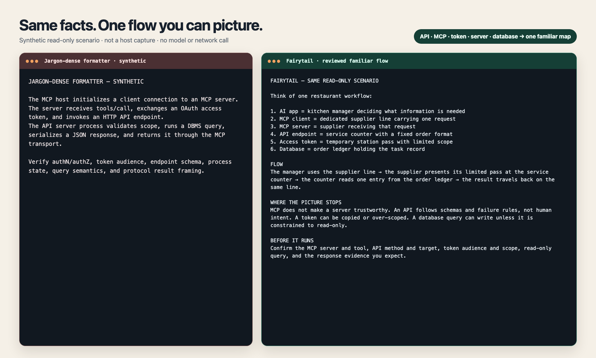

# Fairytail 한국어 안내

> [영문 README](README.md)가 정본입니다. 이 문서는 한국어 사용자용 핵심
> 안내입니다.


**코드는 짧게. 설명은 필요할 때만, 초보자가 그려볼 수 있게.**

[Codex 빠른 시작](#codex-빠른-시작권장) · [영문 정본](README.md) ·
[성능](docs/PERFORMANCE.md) · [개인정보 보호](PRIVACY.md)

Fairytail은 Claude Code와 Codex에 붙는 초보자 친화 플러그인입니다. 평범한
질문과 사소한 수정은 기존 호스트에 맡기고, 비사소한 저장소 구현에는 작은 코드를
유도하는 정책을 적용합니다. 사용자가 Fairytail·비유·개인화·초보 설명을 직접
요청하거나 첫 시스템 설계를 하는 순간에는 검수된 개념 설명을 영어 또는
한국어로 제공합니다.
Claude Code와 Codex는 같은 스킬 설명의 의미를 보고 이 경로를 선택하며,
Fairytail이 별도의 키워드 분류기를 중복 운영하지 않습니다.

## 30초 예시

> “첫 앱을 설계 중이야. MCP, API, access token, server, database가 어떻게
> 연결되는지 식당 업무에 비유해서 설명해줘.”



왼쪽은 같은 흐름을 전문용어로 압축한 합성 예시이고, 오른쪽은 하나의 익숙한
그림, 비유가 깨지는 지점, 실행 전 확인 항목까지 붙인 예시입니다. 실제 호스트
답변을 골라낸 스크린샷이나 사람의 이해도 결과는 아닙니다.

공개 클론에서 Node.js 22 이상만으로 고정된 API/server/database 데모를 실행할
수 있습니다. 의존성 설치와 API 키는 필요하지 않습니다.

```bash
npm run --silent demo
npm run --silent demo -- ko
```

이 명시적 데모는 저장된 프로필과 데이터 경로를 읽지 않고 기본 메모리 상태에서
설치된 호스트와 같은 제한형 렌더러를 사용합니다. 재현 가능한 제품 예시이며
호스트 라우팅이나 사람 이해도의 벤치마크는 아닙니다.

같은 GPT-5.6 Sol과 같은 자연어 구현 요청을 사용한 Codex 1회 페어에서는 두
결과가 모두 요구한 안전 사례를 통과했습니다. Fairytail은 별도 명령 없이 자동
선택됐고, 추가 구현 소스는 38줄에서 22줄로 42% 줄었으며 최종 답변은 둘 다
49단어였습니다. 한 번의 예시 실행이므로 일반적인 토큰 절감 주장으로 쓰지
않으며, 전체 입력 토큰은 Fairytail 쪽이 더 높았습니다. 상세 조건은
[성능 문서](docs/PERFORMANCE.md)에 있습니다.

## 현재 성능 경계

| 측정 항목                              |                                            현재 결과 |
| -------------------------------------- | ---------------------------------------------------: |
| 검수된 alias × 언어                    |                                       **52/52 통과** |
| 한·영 의미 기반 의도 계약              | **64개**: Concept 48 + Build 16, 영어 32 / 한국어 32 |
| 기본 비유 계약                         |         언어별 **10/10 개념군**, 각각 비유 한계 포함 |
| 개인 비유 회귀검증                     |          **30/30 통과**, 하드 실패 0, 기술 사실 불변 |
| Codex 초보자 온보딩 여정               |   격리된 한국어 첫 사용 시뮬레이션 **7/7 과업 통과** |
| 가장 큰 실제 설명 payload              |                                      **1,013바이트** |
| 개념 하나의 하드 상한                  |                                            **4 KiB** |
| API + server + database 연결 설계 지도 |                    **1,581바이트**, 12 KiB 상한 이내 |
| 같은 시나리오의 alias 묶음             |    **alias 3개 → 검수 카드 1개**, 한국어 1,013바이트 |
| Fairytail 프롬프트 제출 훅             |                  **없음**, 주입 컨텍스트 **0바이트** |
| 공유 스킬 설명                         |    호스트 포장 전 **2,485바이트**, 2.5 KiB 예산 이내 |
| 직접 렌더러의 추가 작업                |             **모델 호출 0**, 네트워크 0, 명령 실행 0 |
| 전체 감사 포맷의 지원 항목             |                     합성 5개 사례 모두 **2/9 → 9/9** |

즉, 친절한 설명을 위해 저장소를 다시 탐색하거나 다른 모델이 장문의 답을 새로
만드는 경로가 기본값이 아닙니다. 이미 검수된 로컬 콘텐츠를 정해진 크기 안에서
렌더링합니다. 별도의 전체 감사 포맷에서 측정한 `2/9 → 9/9`는 필요한 설명
항목의 존재 여부입니다. 사용자가 보는 짧은 직접 답변의 길이 지표도, 사람의
이해도 점수도 아닙니다.

같은 검수 시나리오를 공유하는 alias도 한 번만 렌더링합니다. 예를 들어
`api-key`, `access-token`, `llm-token`을 함께 물으면 요청한 이름 세 개는
보존하되 같은 구분 카드를 세 번 반복하지 않습니다.

## 언제 켜지고 언제 조용한가

| 사용자 요청                                        | 동작                                                     |
| -------------------------------------------------- | -------------------------------------------------------- |
| “Fairytail로 MCP를 한국어로 설명해줘.”             | 풍부한 검수 설명                                         |
| “내가 이해할 만한 비유로 API를 설명해줘.”          | 승인된 개인 비유, 없으면 표시된 범용 첫 비유             |
| “첫 앱 설계 중이야. API, server, DB를 설명해줘.”   | 최대 3개 개념의 제한된 초기 설계 묶음                    |
| “API가 뭐야?”                                      | 호스트 기본 답변; 풍부한 레이어는 끔                     |
| “버튼 문구만 바꿔줘.”                              | 호스트의 기본 수정; Fairytail 워크플로·추가 승인 없음    |
| “이 기능을 가장 작고 안전하게 구현해줘.”           | 비사소한 저장소 구현이면 최소 구현 정책을 의미 기반 선택 |
| `/fairytail:build ...` 또는 `$fairytail:build ...` | 같은 정책을 확실히 부르는 명시적 우회로                  |

두 호스트는 같은 의미 기반 스킬 설명을 읽습니다. 호스트가 선택한 뒤에만 전체
스킬 본문과 로컬 렌더러가 실행되며, `UserPromptSubmit` 키워드 라우터는 없습니다.
`build`는 비사소한 구현 경계에서만 의미 기반 선택을 허용합니다. `before`,
`finish`, `personalize`는 수동 전용이고 `doctor`와 `profile`도 명시적으로
호출할 때만 쓰는 관리 스킬입니다. 48개 Concept 사례와 16개 Build 사례를
분리해, 비사소한 구현에서 Concept는 꺼지고 Build만 켜지는 정상 동작까지
표현합니다. 실제 선택은 릴리스 전 제한된 라이브 프롬프트로 따로 확인합니다.

## 개인화는 직업 분류표가 아니다

범용 영어·한국어 설명과 로컬 프로필 온보딩은 두 호스트에서 모두 작동합니다.
Claude Code는 플러그인 데이터 폴더를, Codex는 별도 설정이 없으면
`${CODEX_HOME:-~/.codex}/fairytail`을 사용합니다. 사용자가 이 경로를 알거나
직접 설정할 필요는 없습니다.

1. Codex의 Fairytail Onboard 스킬 또는 Claude Code의
   `/fairytail:onboard`를 열고, 안내된 로컬 터미널에서 영어 또는 한국어 5문항에
   답합니다.
2. 직업 카테고리 하나를 고르는 대신 본인이 실제로 익숙한 상황·역할·물건·절차를
   직접 입력합니다. 이 로컬 파일이 진실원천입니다.
3. 개인화를 승인하면 언어, 설명 선호, 짧은 승인 라벨 최대 5개만 제한된 비유
   매핑 요청에 들어갈 수 있습니다.
4. 매퍼는 미리 정의된 명사 자리만 채웁니다. 기술 사실, 관계 방향, 안전 경계,
   코드, 명령, 권한, 검증 결과는 바꿀 수 없습니다.
5. 유효한 매핑은 로컬에 저장해 재사용합니다. 온보딩 전과 승인된 개인 매핑을
   아직 만들지 않은 동안에는 직업을 추정하지 않는 개념별 범용 비유를 쓰고,
   저장된 중립/비유 없음 선택은 항상 우선합니다.

병원·온라인 상점·인문학 학생 같은 세 개의 기존 세계는 회귀 테스트용 고정
fixture일 뿐 실제 사용자의 유형이 아닙니다.

현재 검수 범위는 10개 개념군입니다. 서로 이어서 보기 좋은 API·server·database
세 개의 기본 카드만 식당 흐름을 공유하고, 나머지 일곱 개는 공구함·공연 준비
카드·출입 배지·안내 데스크·업무철·공개 무대처럼 다른 그림을 씁니다. 사용자가
직접 입력한 익숙한 세계는 정확한 역할 슬롯 검증 뒤 기본 그림을 대체할 수
있습니다. 지원하지 않는 새 개념은 억지로 검수된 비유라고 부르지 않고 호스트의
일반 답변으로 넘깁니다.

## 설치

Node.js 22 이상과 Claude Code 또는 Codex CLI가 필요합니다. 일반 사용에는
`npm`, 소스 저장소 클론, `AGENTS.md` 수정이 필요하지 않습니다.

### 코딩 에이전트에게 설치 맡기기

터미널을 쓸 수 있는 Codex나 다른 코딩 에이전트에게 이 README 또는 저장소
주소와 아래 요청을 함께 전달하면 됩니다.

```text
https://github.com/ernestolee13/fairytail 의 Fairytail을 설치해줘.
내 환경이 Codex CLI인지 Claude Code인지 확인하고 Node.js 22 이상인지 검사한 뒤,
README에서 해당 호스트의 marketplace 설치 명령만 사용해줘. 소스 클론, npm 실행,
현재 프로젝트 파일 수정은 하지 마. 호스트 CLI로 설치 결과까지 검증한 다음 새
thread 또는 session을 시작하라고 안내하고, Fairytail의 비공개 온보딩을
도와준 뒤 내 언어로 된 첫 사용 예시 하나를 줘.
```

에이전트에는 설치 명령을 실행할 일반 권한이 필요합니다. 이미 열린 Codex
thread는 방금 설치한 플러그인을 다시 읽을 수 없으므로 새 thread 단계는
생략하지 않습니다.

### Codex 빠른 시작(권장)

먼저 실행 환경을 확인합니다.

```bash
node --version
codex --version
```

최초 설치라면 공개 marketplace를 추가하고 Fairytail을 설치합니다.

```bash
codex plugin marketplace add ernestolee13/fairytail
codex plugin add fairytail@fairytail
codex plugin list --json
```

마지막 결과에 `fairytail`이 설치됨으로 표시되어야 합니다. **새 Codex
thread**를 열고 `/skills`에서 `Fairytail Onboard`, `Fairytail Doctor`,
`fairytail-explain-concept`가 보이는지 확인합니다.

아래 두 줄은 **터미널이 아니라 Codex 대화창**에 입력합니다.

```text
$fairytail:doctor 프로필 답변을 보여주지 말고 설치 상태를 점검해줘.
$fairytail:onboard 프로필을 한국어로 설정해줘.
```

온보딩 스킬은 먼저 민감하지 않은 상태만 확인합니다. 설정이 필요하면 설치된
플러그인의 실제 경로가 들어간 `node ... fairytail-profile.mjs onboard --host
codex --locale ko` 명령 하나를 보여줍니다. 이 명령을 별도 로컬 터미널에 붙여
넣고 그 안에서 5문항에 답합니다. 원본 배경 답변을 Codex 대화에 적을 필요가
없습니다. 저장 완료 문구가 나오면 Codex로 돌아옵니다. 이제
`$fairytail:doctor`는 답변을 노출하지 않고 `onboarding.required: false`를
보고합니다.

`fairytail:` 네임스페이스가 붙은 호출은 다른 하네스에 동명의 `doctor`나
`onboard` 스킬이 있어도 이 플러그인을 정확히 가리킵니다. `/skills`에서도 같은
구성요소가 `fairytail:doctor`, `fairytail:onboard`로 표시됩니다. Fairytail은 다른
플러그인을 수정하거나 교체하지 않습니다.

그다음 **Codex 대화창**에서 가장 확실한 설명 직접 호출을 사용합니다.

```text
$fairytail:fairytail-explain-concept MCP를 초보자용 한국어 비유와 그 비유의 한계까지 포함해 설명해줘.
```

심사위원용 고정 데모 묶음은 다음처럼 실행합니다.

```text
$fairytail:fairytail-explain-concept demo ko
```

풍부한 설명이 필요하다는 의도를 자연어로 말해도 됩니다.

```text
첫 앱을 설계 중이야. API, server, database가 어떻게 연결되는지 하나의 익숙한 비유로 설명해줘.
```

이 경우 Codex가 설명의 의미를 보고 Fairytail을 선택할 수 있습니다. 반드시
Fairytail을 쓰고 싶을 때는 완전한 이름인
`$fairytail:fairytail-explain-concept`를 직접 붙입니다. 반대로 `API가
뭐야?`처럼 짧은 일반 질문은 의도대로 Codex 기본 답변에 맡깁니다.

비사소한 저장소 구현을 자연어로 요청하면 Codex가 별도의 최소 구현 정책을
선택할 수 있습니다. 반드시 같은 정책을 쓰고 싶을 때는 완전한 이름을 붙입니다.

```text
$fairytail:build 이 기능을 가장 작고 안전하게 구현해줘.
```

Fairytail은 기존 `AGENTS.md`, 다른 스킬, 오케스트레이션 플러그인과 함께
작동하며 이 파일들을 수정하지 않습니다. Codex에서는 검수된 영어·한국어 범용
비유를 즉시 사용할 수 있고 `$fairytail:onboard`, `$fairytail:profile`,
`$fairytail:doctor`로 5문항 로컬 프로필도 관리할 수 있습니다.
`$fairytail:personalize`는 선택적인 수동 기능입니다. 이를 실행하지 않아도 승인된
프로필은 빈 설명 대신 검수된 범용 비유를 받습니다.

Codex 설치를 갱신하려면 marketplace snapshot을 새로 받은 뒤 플러그인을 다시
설치하고 새 thread를 시작합니다.

```bash
codex plugin marketplace upgrade fairytail
codex plugin remove fairytail@fairytail
codex plugin add fairytail@fairytail
```

Fairytail을 완전히 제거하려면 다음 두 명령을 사용합니다.

```bash
codex plugin remove fairytail@fairytail
codex plugin marketplace remove fairytail
```

스킬이 보이지 않으면 `codex plugin list --json`으로 설치 상태를 다시 확인하고,
Codex를 재시작한 뒤 `/skills`를 엽니다.

#### Codex 문제 해결과 프로필 복구

- `node --version`이 22보다 낮으면 Node.js 22 이상을 설치하거나 활성화한 뒤
  설치 명령을 다시 실행합니다.
- 로컬 온보딩 명령이 실패하면 Codex 대화창에 `$fairytail:doctor`를 입력합니다.
  필요하면 marketplace snapshot을 갱신·재설치하고 새 thread에서 온보딩을 다시
  시작합니다.
- 저장된 설정이 잘못됐다면 Codex 대화창에 `$fairytail:profile`을 입력합니다.
  안전한 상태 확인은 에이전트가 할 수 있지만, 원본 값이 나오는 `edit`와
  `preview`는 별도 로컬 터미널에서 실행할 명령으로만 안내합니다.
- `neutral`은 프로필을 로컬에만 두고 모델에 투영하지 않습니다.
  `no-analogy`는 개인·범용 비유를 모두 끕니다. `reset`은 빈 로컬 프로필로
  되돌리고, `delete`는 정확한 Fairytail 프로필 파일 하나만 지웁니다. 변경은
  사용자가 그 작업을 명시적으로 요청한 경우에만 실행합니다.

### Claude Code

```bash
claude plugin marketplace add ernestolee13/fairytail
claude plugin install fairytail@fairytail
claude plugin enable fairytail@fairytail
```

새 세션에서:

```text
/fairytail:doctor
/fairytail:onboard
```

명시적인 설명 요청 예시:

```text
Fairytail로 MCP를 한국어로, 초보자가 이해할 비유와 함께 설명해줘.
```

## 기술적으로 어떻게 연결되는가

```text
기본 질문·사소한 수정 ─────────────────────► 호스트 기본 경로

비사소한 저장소 구현 ─► 의미 기반 최소 구현 정책 선택 ─┐
직접 부른 구현 정책 ─────────────────────────────────┘
                                             │
                                             ▼
                                  가장 작은 올바른 diff

초보·비유가 필요한 의미 ─┐
초기 시스템 설계 의도 ───┴─► 호스트가 공유 스킬 선택
                                  │
                                  ▼
                              검수된 개념 alias
                              │
로컬 프로필 + 승인된 매핑 ───┤
프로필 없음 ─► 범용 첫 비유 ──┤
                              ▼
                       영어/한국어 결정적 렌더러
                        개념당 4 KiB, 최대 3개
```

직접 개념 설명은 두 호스트 모두 결정적 로컬 경로를 사용합니다. 사용자가
개인화를 직접 호출한 경우에만 현재 호스트 모델이 이미 승인된 명사 자리를 채울
수 있고, 로컬 검증기가 그 외의 내용을 거부합니다. 상세 구조는
[ARCHITECTURE.md](ARCHITECTURE.md)에 있습니다.

## 기존 하네스와의 관계

Fairytail은 Claude Code, Codex, Superpowers, oh-my-opencode, oh-my-codex 같은
기존 하네스를 교체하지 않습니다. 계획, 도구 권한, 실행, 완료 판단은 호스트가
유지합니다. `AGENTS.md`, `CLAUDE.md`, `.omx/`, `.omo/`나 다른 플러그인의 파일을
덮어쓰지 않습니다.

## 개인정보와 한계

- 원본 프로필은 Fairytail의 로컬 데이터 폴더에만 저장됩니다.
- 중립 설명과 비유 없음 모드에서는 Fairytail 프로필 투영을 보내지 않습니다.
- 개인화 매핑에는 사용자가 미리 본 승인 필드만 들어갑니다.
- 프롬프트, 소스 코드, 명령, 도구 출력, 시크릿, 로그, 학습 기록은 제외됩니다.
- Fairytail은 프롬프트 제출 훅이나 원문 로거를 설치하지 않습니다. 스킬 선택은
  호스트의 일반 의미 기반 라우팅에 맡깁니다.
- 비유는 권한을 주거나 안전 검사를 약하게 만들 수 없습니다.
- 아직 동의한 초보자 파일럿은 `0/3`이므로 사람의 이해도 향상을 입증했다고
  말하지 않습니다.

자세한 내용은 [PRIVACY.md](PRIVACY.md), 현재 측정은
[docs/PERFORMANCE.md](docs/PERFORMANCE.md), 실제 설치 경계는
[docs/PUBLIC_INSTALL_AND_SAMPLES.md](docs/PUBLIC_INSTALL_AND_SAMPLES.md)에 있습니다.

## 소스에서 검증

```bash
git clone https://github.com/ernestolee13/fairytail.git
cd fairytail
npm ci
npm run check:context-gate
npm run smoke:codex:beginner
```

마지막 명령은 격리된 `CODEX_HOME`에서 한국어 첫 상태, 5문항 저장, doctor,
범용 대기 비유, 승인된 개인 매핑, 재사용까지 7개 과업을 실행합니다. 자동화된
제품 여정 검증이며 실제 사람의 이해도 실험은 아닙니다.

MIT 라이선스입니다. 최소 구현 정책은 Ponytail의 고정 commit을 MIT 조건으로
차용했고, 프로필·설명·한국어 렌더링·안전 레이어는 Fairytail의 별도 구성입니다.
